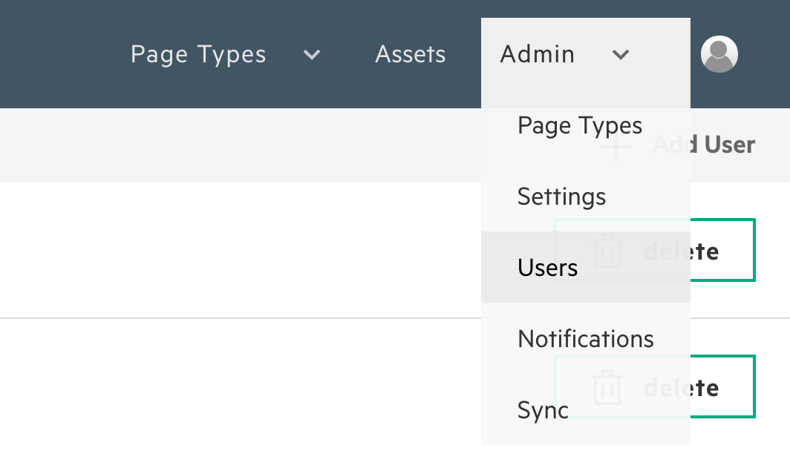
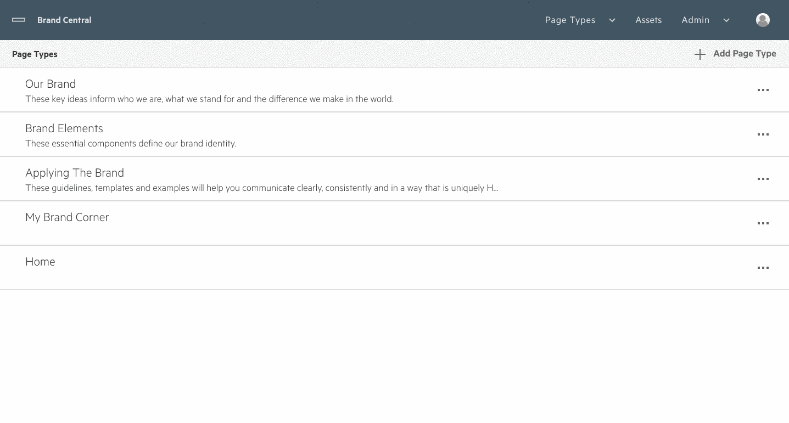
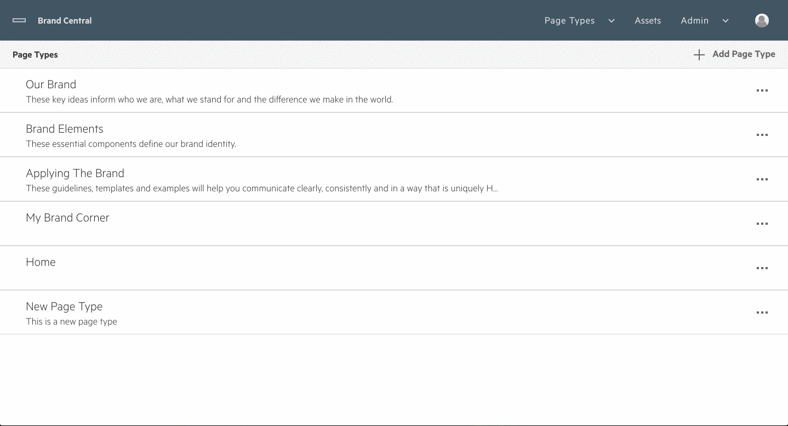
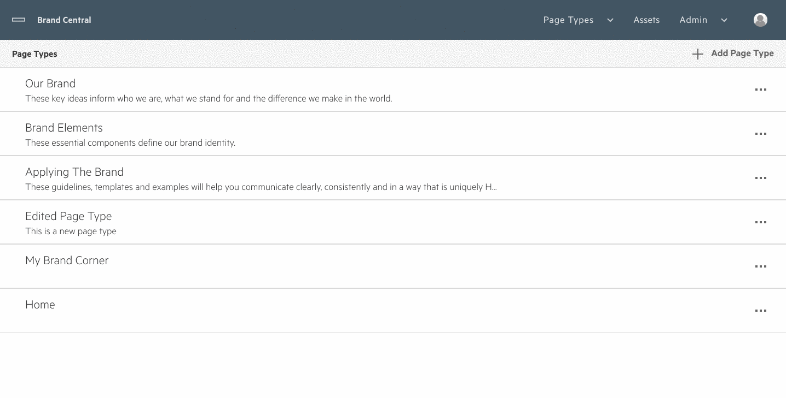
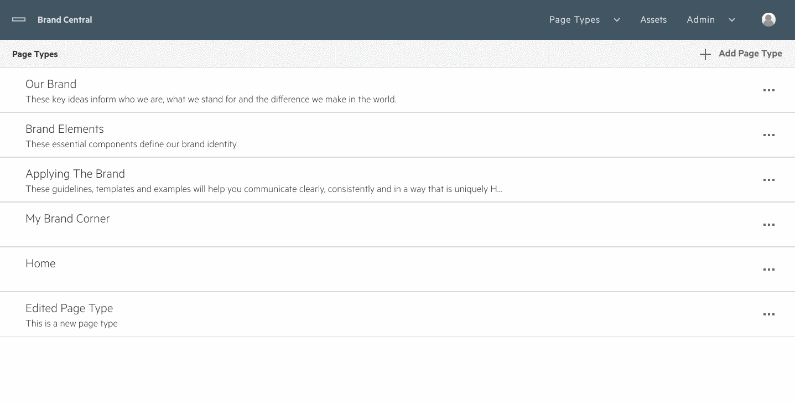
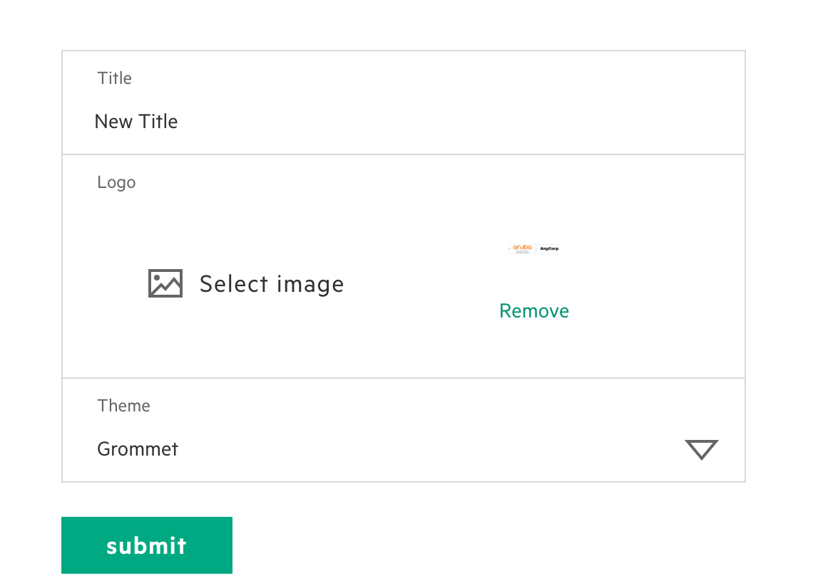
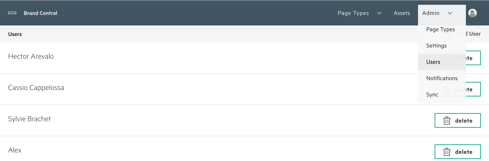
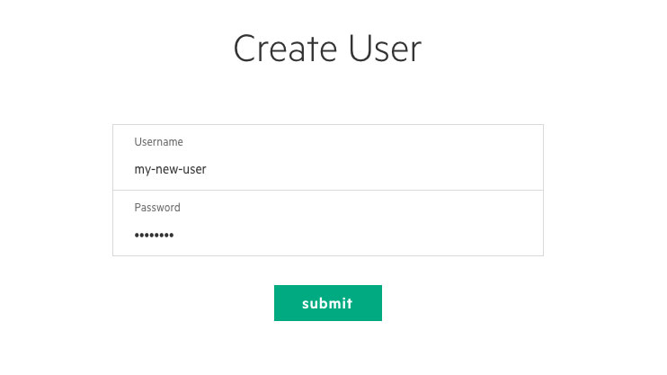
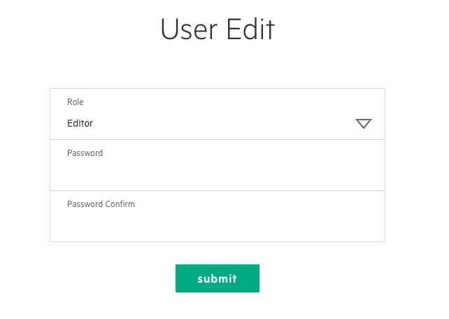
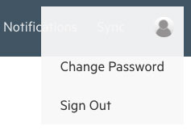

# Administration

## Intro
Administration in the Grommet CMS is role based. Currently the CMS supports two user roles - admins and editors. The features covered in this section will only be accessible by admins.

When you are logged in as an admin, you have a special admin menu that is available to you from the top navigation bar.

## Page Type Management
Page types group together related content on the site.  In order to manage the page types for the site, you must first navigate to the Page Type management page through the admin menu.

### __Add a Page Type__
To add a page type, select the "Add Page Type" button.  Fill out the form that is presented and then tap the "Submit" button.

### __Edit a Page Type__
To edit a page type, select the menu that corresponds to it and click the "Edit" button.  Fill out the form that is presented and then tap the "Submit" button.

### __Delete a Page Type__
To delete a page type, select the menu that corresponds to it and click the "Delete" button.  Confirm that you'd like to delete the page type by pressing the "Submit" button on the layer that is presented.  Please be aware that deleting a page type will delete all posts that are associated with it.

### __Move a Page Type__
To move a page type, select the menu that corresponds to it and click the "Move Up" or "Move Down" button.  Doing so will change the order that the page type appears on the front end and in the navigation menu. 

## Settings
The site's settings are accessible through the admin menu.  From the settings page, you are able to set the title of the site, the logo and a theme.  Please reference the [Grommet documentation site](https://grommet.io) for more information on the available themes.

## User Management
The main user page is accessible through the admin navigation menu. Once you have navigated to the user page a list of current CMS users will be available. To edit a user simply click their user name. 

### __Creating New Users__
To create a new user, click the Add User button in the user page navigation bar. You will then navigate to the create user page where a username and password are required to create a user. 

### __Editing Users__
To edit a user click their name in the user page. You will then navigate to the edit user page where a user's password or role can be changed.

### __Admins__
Admin users have full control in the CMS. Admin access should only be granted to trusted users as syncing can result in overwriting data. To grant a user admin access simply click their name in the user list and select Admin from the dropdown.

### __Editors__
Editors are the default user role and have restricted access to Grommet CMS features. When a new user is created they are automatically set to an editor. Editors can create/edits pages, create/edits assets, and change their password.

### __Changing Passwords__
Both admins and editors can access the edit user form from the user icon dropdown in the main navigation bar. Admins have access to change any user's password. If an editor forgets their password, they can contact an Admin to reset their password.

## Synchronization
Synchronization is a powerful feature within the Grommet CMS feature suite but like the great Spider-man adage goes:

> With great power comes great responsibility.

Syncing is used to keep environments ranging from development, testing or production in sync. An admin must always consider the consequences when syncing environments. Depending on how many assets need to sync and your internet connection this process can take between 30 seconds and 30 minutes.

Syncing has two directions - **push** and **pull**.

### __Push__
An admin has the ability to push all data or a specific page. Push will take the current copy of data and overwrite the destination's data. Generally, an admin will be pushing data from a testing server to a production server or from a local development build to a testing server. An admin must keep in mind that even when pushing a single page all CMS assets on the destination server are overwritten with the local copy of assets.

### __Pull__
An admin has the ability to pull all data or a specific page. Pull will take a destination target's data, generally a production server, and overwrite the local data. Generally, when a new developer is setting up a local environment they can Pull all data to get an up-to-date copy of the production database.
