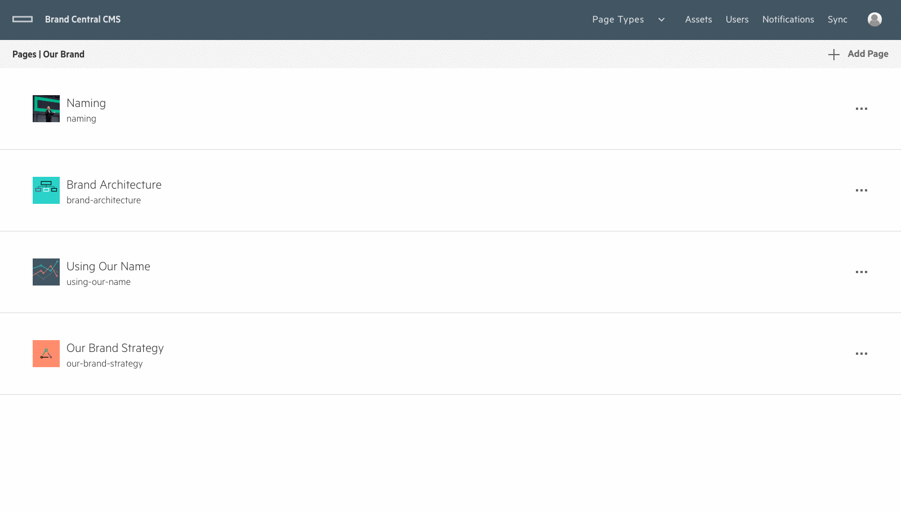

# __Asset Management__

## Intro
The grommet content management system has a fully featured asset library built into it, making it possible to maintain the thousands of assets that are used on the Brand Central site.  One of the guarantees of the asset management is that images can be changed without leading to 404s in the content.  In other words, when you change an image in the asset management library, your changes will propagate to the content where that image is used.  This way, you can make sweeping changes to assets that might be used in several areas of the site.

## Asset Page
The main asset page is accessible through the navigation bar.  When you first land on the asset page, you will see a table view.  This view allows you to sort and filter the entire asset library.  You can also add, edit and delete assets from this view.

### __Navigating around the Asset Page__
There is a lot of functionality packed into the asset page.  You can change the view of the page to show the assets in a grid view rather than a table view, for example.  Also, the assets are paginated using an infinitely scrolling list.  As you scroll down the page, more and more assets will load when you reach the bottom of the currently loaded assets.

### __Sorting and Filtering__
The asset page includes a number of different ways to filter and sort your asset library.  Since the site has more than 2K assets, these features are essential for you to organize and find assets.

#### Searching
On the top of the asset page, you have a search bar that will allow you to send a query to the server to find an asset by title.  Simply type a term you would like to find.  The search will begin as soon as you are done typing.  Matched terms will be highlighted in the list.

If you'd like to clear the search field, you can select the text and delete it.  Alternatively, you can press the ____ "clear" button on the filter assets layer to clear all filters, including the search term.

#### Sorting
The asset page table view provides you with the ability to sort the assets by any field.  Simply click on the table column header to toggle it to ascending / descending.  The list will automatically sort itself based on the selected header.

#### Filtering
At the current time, we have only one type of filter, however more could be added at a later time.  To filter the asset table / grid, select the ____ "Filter" button.  You will be presented with the asset filter layer, where you can select the a page to filter the assets by.  Selecting one of the pages will show you only the assets that are used in content blocks on the selected page.

In order to clear the filter, you will press the "clear" button on the asset filter layer as explained above in the search paragraph.

### __Add an Asset__
Adding as asset is as simple as tapping the ____ "Add Asset" button.  From here, you will be presented with a screen that has the Grommet FileDropzone.  You can drag the file you wish to upload onto the dropzone or click it to upload it using the browser's file system.  The title will fill out automatically based on the name of the file and you can change it if need be.  When finished, press the ____ "submit" button to save the file and navigate back to the asset management view.

### __Edit an Asset__
In order to edit an asset, you first need to select it from the asset table / grid.  You will navigate to a single asset view, where you have the option to change the image title and to select a new image.

 

### __Delete an Asset__
You can permanently delete an asset, but please be advised that it is a destructive operation and that it may have unexpected results if this asset is used on your site.  

#### Single asset deletion
To delete a single asset, select the ____ "Trash" icon corresponding to the asset in either the asset table view or the asset grid view.  A confirmation layer will appear.  If you are sure that you want to delete this asset, press the "delete" button. Otherwise, press the ____ "cancel" button to close the layer.

You may also delete multiple assets at a time from the asset table view.  Select the checkboxes next to the assets you wish to delete and then press the ____ "Delete selected assets" button on the toolbar that appears at the bottom of the screen. A confirmation layer will appear.  If you are sure that you want to delete these assets, press the "delete" button. Otherwise, press the "cancel" button to close the layer.

