# Content Block Types

Below is an explanation of the various content block types and their options.  Please note that these options change from time to time, so while we will keep this up-to-date, your best bet for learning them is to get your hands on them on the [Demo site](https://bc.8ar.ms/dashboard).

## Box

The box content block corresponds to the [Grommet Box component](https://grommet.github.io/docs/box).  It allows you to add a colored box of a variety of sizes with optional text content inside of it.

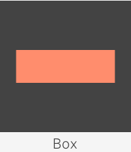

By default, the box will be created without any sizing, so it will size automatically to the content inside of it.  Use the advanced layout form to size the box up to fill the given space.

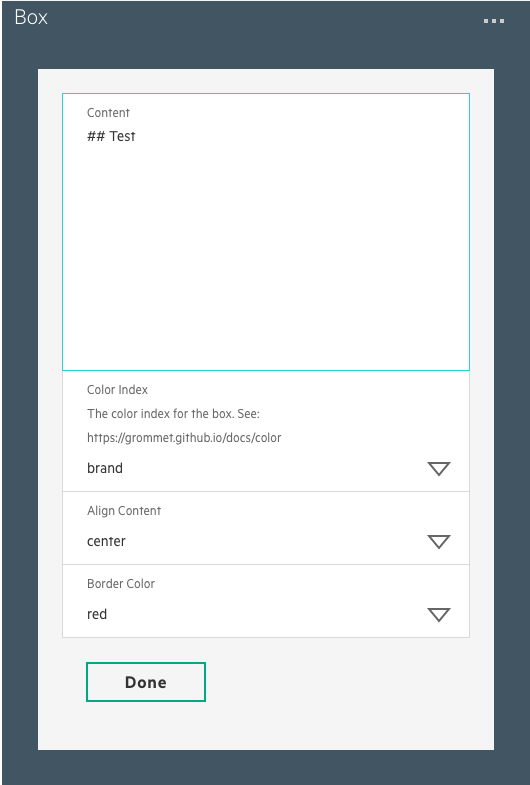

By default, text content will be aligned in the center of the box, but you can change the alignment with the "Align Content" select menu.  You can also add a bottom border color to add contrast to the box.  Note that the text content will be colored by Grommet so that it will contrast to the background of the box.

## Paragraph

The paragraph content block corresponds to the [Grommet Paragraph component](https://grommet.github.io/docs/paragraph).  It allows you to add text using Markdown to give you control of the typography.  It also allows you to control the `align` and `size` properties.

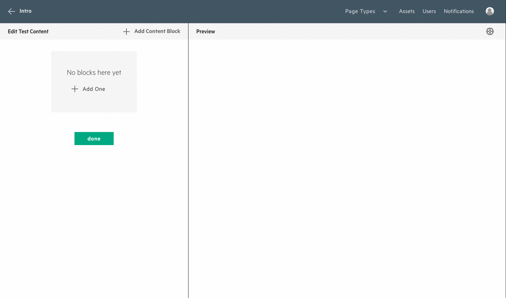

## Paragraph w/ CTAs
The Paragraph with CTA content block allows you to add text content with 1 or more call-to-actions (CTAs).  The CTAs will show in an unordered list below the text content.

## Headline

The headline component corresponds to the [Grommet Headline component](https://grommet.github.io/docs/headline). The headline content field does not allow for markdown since the styling is applied by the grommet component.  However, you can set the `size` and `strong` properties to control the typography.  Also, a headline by default will take up an entire row and any content added after it will be pushed onto the next line automatically.

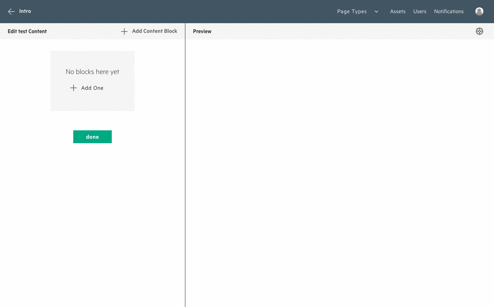

## Image

The Image component corresponds to the [Grommet Image component](https://grommet.github.io/docs/image).  The component has several options that allow you to customize the image.  It has a `content` property that can hold Markdown styled text to be placed as a caption underneath the image.  The `Alt Tag` represents a tag that the browser will use to make the image accessible to users with poor vision.  There is also a `Border Color` property that allows you to set a bottom border in either green or red.  This border can be used for Do's / Don'ts and other types of content.

To select the asset to use for this content block, tap the __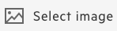__ "Select Image" button.  This will present you with the asset selection layer, allowing you to select a single asset.  After selecting the asset, the `Image file Path` property will be filled in automatically.

## Image Gallery
The Image Gallery content block was custom made for the Brand Central CMS to allow you to post a collection of images that the user can click through.  Much like the Hero and Carousel content blocks, the Image Gallery allows you to select multiple assets as slides. Any content block that allows for multiple assets will also allow you to reorganize and edit the slides.  See below for an example of how to add, reorder and delete slides.

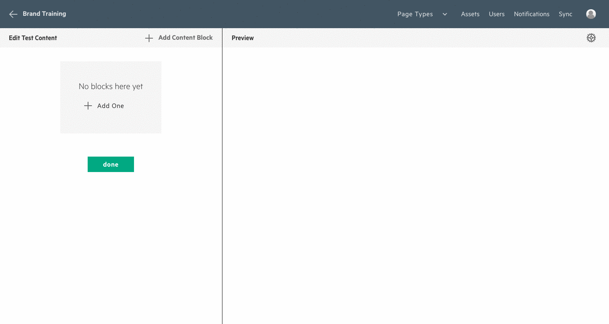

## Hero
The Hero content block allows you to select multiple images, which whill be selected at random when the hero renders.  Only one image shows at a time.  You are capable of setting a headline, paragraph and a button, which will show on top of an overlay in the center of the hero.

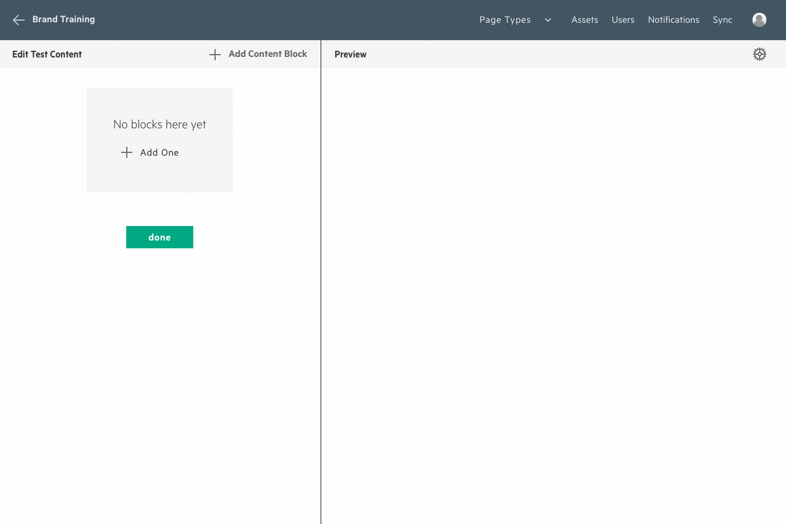

## Marquee
The Marquee content block is very similar to the Hero content block, the main difference being the style of its content.  Content will not have a background color and it will be positioned either on the left-hand or right-hand side of the screen.  You also have the option to set the text color.  This allows you to position content in the right place and gives you control to have both light and dark images that the text will contrast on top of.

## Carousel
The Carousel content block corresponds to the [Grommet Carousel Component](https://grommet.github.io/docs/carousel).

## Carousel with content
The Carousel with content was made specifically for the homepage of the Brand Central site.  It's a carousel component that allows you to add content to each slide.  Much like the Marquee component, it allows you to position the content and to change the color to either White or Black.

## Video
The Video content block corresponds to the [Grommet Video Component](https://grommet.github.io/docs/video).  When adding a video, you can select both the video asset and an image to use as the poster image for that video.

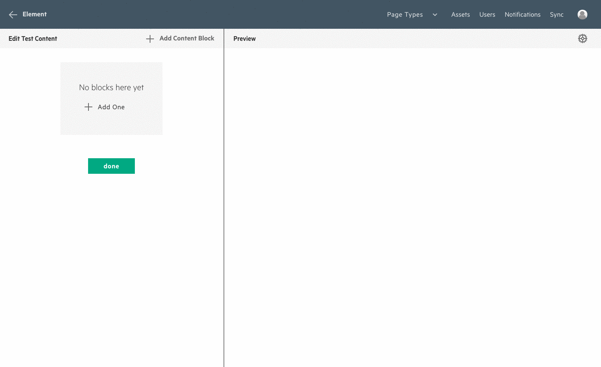

## Card
The Card content block corresponds to the [Grommet Card Component](https://grommet.github.io/docs/card).

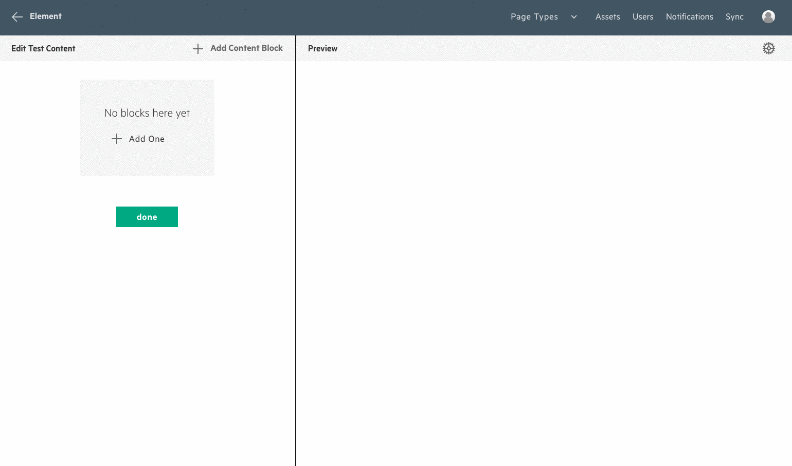

## Quote
The Quote content block corresponds to the [Grommet Quote Component](https://grommet.github.io/docs/quote).  It allows you to set content and an author.

## Color Swatch
The color swatch content block represents a way to show a specific color that HPE uses in its branding.  It allows you to set a color for the swatch using a hex code and to place markdown text beneath that color.  Unlike the majority of the other content blocks, the color swatch will only grow to 80% of its container.

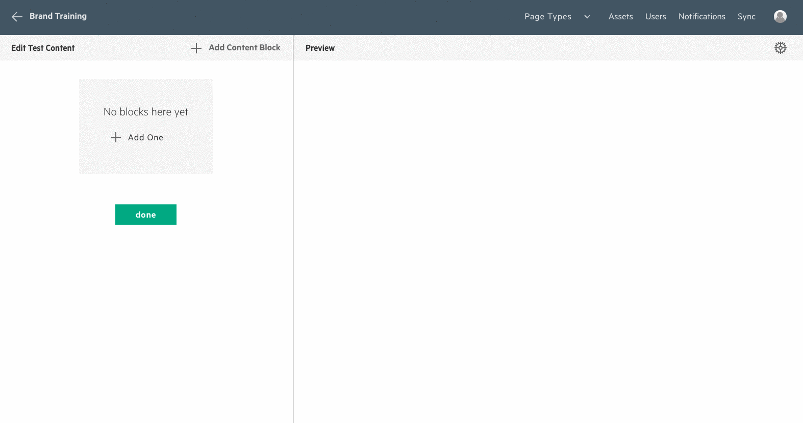

## Spacer
The spacer component allows you to add spacing to a grid in the case that you want content to show on the right hand side of the screen since the content lays out from left to right by default.  The spacer will hide itself on mobile screens so that you are able to acheive responsive grid sizing on mobile devices.

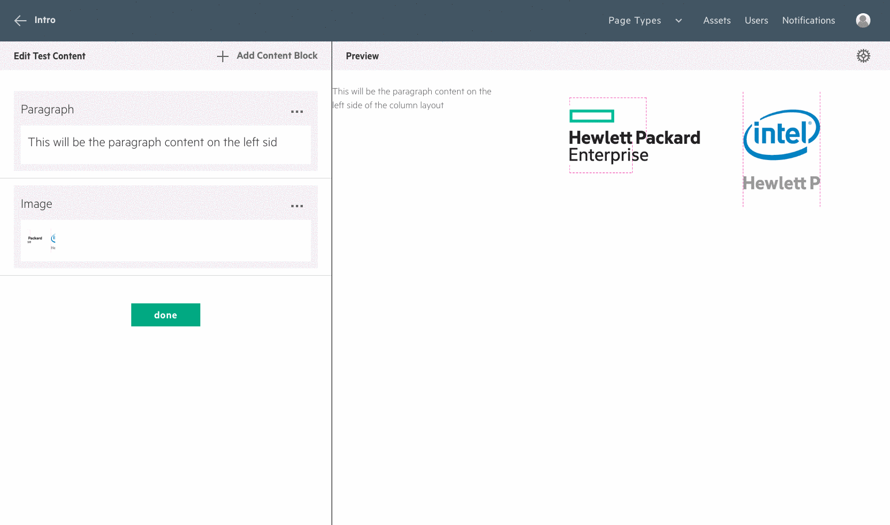

## Button
The button content block represents a call to action.  It can be either a [Grommet Button component](https://grommet.github.io/docs/button) or a [Grommet Anchor component](https://grommet.github.io/docs/anchor).   The Button content block has a lot of different options, giving you control over the look and feel of the rendered control.  If the control is `Primary` and `Anchor`, you have the ability to set an icon that will show in front of the label text.  If it's a `Button`, selecting `Primary` will change it to a solid button.  

The `Primary` property corresponds to the Grommet primary property, so please refer to the [Grommet docs](https://grommet.github.io/) if you have any questions.  Also, you can select either an internal asset path or an external asset path.  An internal path will allow you to link to a relative path internal to the Brand Central site, for example `/content/photography`.  An external path allows you to link to any other url, for example `https://github.com/grommet/brand-central-cms/edit/master/docs/content-management.md`  See below for examples of these combinations.

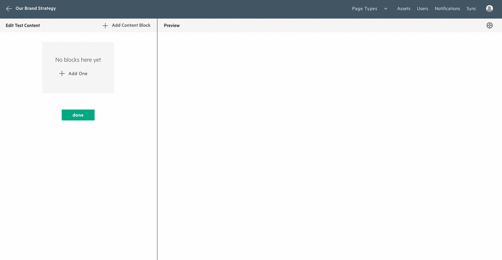