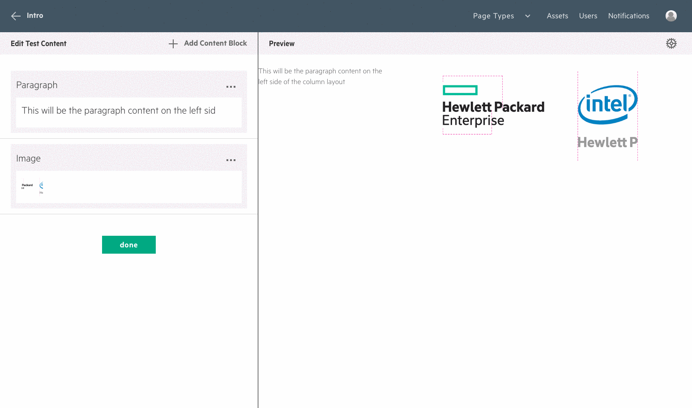

# __Content Management__

## Intro
The fundamental building block of web apps built with Grommet CMS is the content block.  Content blocks represent one single piece of content, that when combined together, make up your site.  The page content view allows you to view the content blocks and the rendered content on the same page, allow you to edit the content of your site in real time.  The order of the page content view list translates to the order as it appears in the preview.  From this view, you have the ability to add, edit and reorder content, which we will go into below.

## Adding a content block
From the page content view, you are able to add a content block by pressing the ____ "Add Content Block" button. You will be presented with a layer that allows selection of a content block type.  Select the box that corresponds to the content block type you wish to add and a new content block will be added to the list.

After you have selected the content block type, a form will be added to the bottom of the list of content blocks.  The form is where you can enter the content for this specific content block.  The form will be different depending on what type of content block you have selected.

As an example, we've added a Paragraph content block.  This is one of the more simple blocks, but as you can see we still have three form fields that we can fill out.  

The first field is the content of the content block.  Most of the text-based content blocks accept [Markdown text](https://en.wikipedia.org/wiki/Markdown), which allows you to control the Typography of the content using a declarative markup language.  If you are new to Markdown, you have the ability to view a cheatsheet by pressing the question mark button next to the ____ "Markdown Supported" label.

Using the markdown syntax, you can add content to this paragraph block.

When you are done adding content, you can take a look at the other various settings and set them to your liking.  See below for a more in depth look at the various content block types.

When you press the ____ "Done" button, the content block will appear in the preview section and will automatically be saved to the database.

On the page content list view, you can manage the content blocks by tapping the ____ "Etc" icon that corresponds to the content block you wish to edit.  This will present a menu containing the most frequent content block operations, which are described below.

### __Editing a content block__
Editing a content block is very much like adding one, except that you will see the content that you entered previously.  To get started, select the ____ "Edit" menu item from the content block management menu.

After pressing the Edit button, you will be presented with the same form as you were when you added the content block.

Once you have made the changes, press the ____ "Done" button to save the changes you've made.  The changes will be reflected immediately in the preview view.

### __Reordering a content block__
The order of the content blocks in the page content list view matters.  The order in which the items appear will be the same order they appear on the preview page.  In order to reorder content, you need to adjust the order of the list items.  From the content block menu, you will have the option to move the content block upwards or downwards.  Note that your changes will be saved automatically when you reorder an item.

### __Deleting a content block__
Deleting a content block is a destructive operation and cannot be undone.  Please be sure that you want to delete a content block before doing so.

### __Duplicating a content block__
Sometimes duplicating content can help you to quickly setup a repeating grid layout.  Duplicating a content block will copy the entire contents of it, including layout and settings.  You can easily edit the content after duplicating it.

### __Layout settings__
The purpose of the layout settings is to make it possible to adjust the layout of content blocks.  This way, you can create grids of content.  

Since Brand Central has a three column layout on the majority of the site, you have the ability to layout content from left to right in intervals of 1/3, 2/3 and full.

To open the advanced layout form, tap the Advanced Layout button in the content block menu.

### __Creating a Grid__
Below is an example of how to create a grid of content with a 1/3 - 2/3 split.

*Grid Layout Example*

In some cases, you may want to position content on the right side of the screen so that you can continue a grid.  This is a common layout on Brand Central.  To acheive this, you need to use the Spacer content block.

