# __Page Management__

## Intro
Sometimes terminology can be the most confusing part of a system, so let's take a moment to clear things up. A Grommet CMS site is made up of pages full of content, which are accessible through the [main tile page](https://h10014.www1.hpe.com/brand-central/main).  The pages are grouped together by "page type", which allows us to group together similar content on the site. Each page is made up of a number of sections, which are comprised of content blocks. At the top level of the content management system, you have the ability to manage the pages of your site.

Let's take a look at how to manage pages through the Grommet CMS.

## Viewing pages

The first page that you will see after logging in is a list of the [recently updated pages](https://h10014.www1.hpe.com/dashboard/homepage).

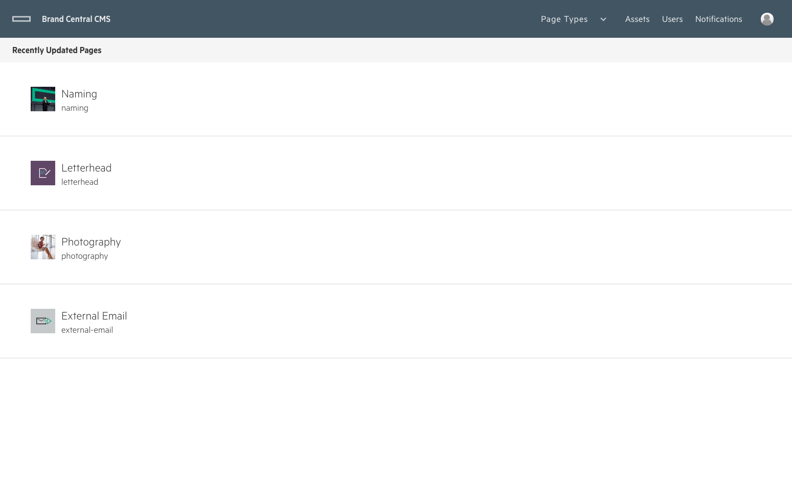

Using the navigation bar, you can navigate to view lists of the various page types on your application.

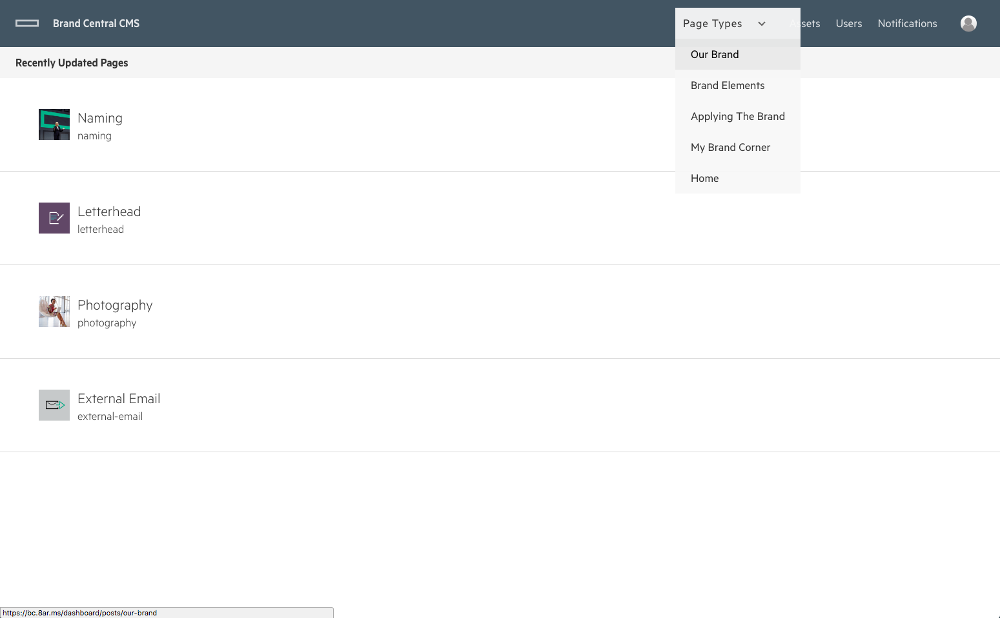

Once you have selected a page type, you will be viewing a list of the pages that will show up as tiles on the main page on Brand Central under the selected page type.

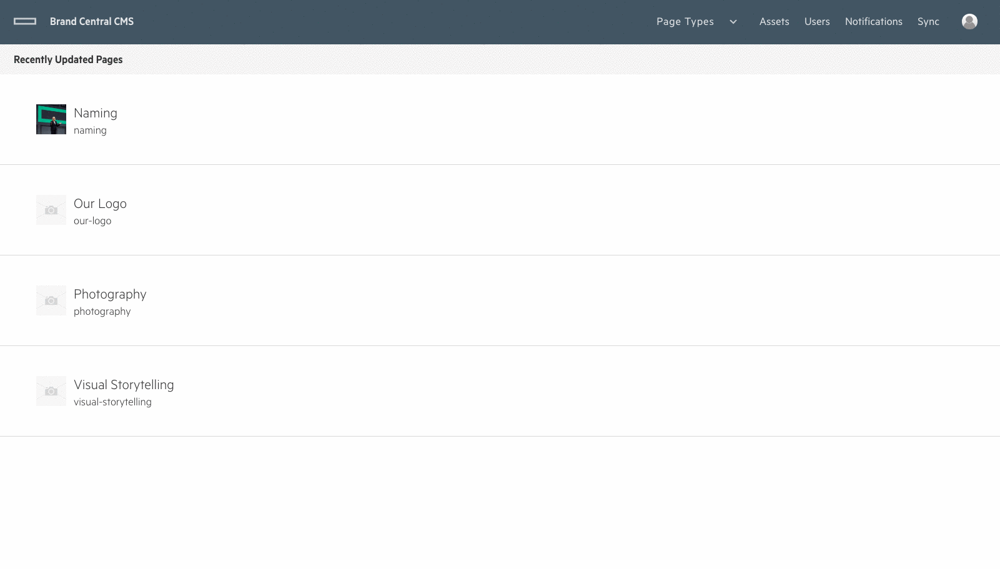

## Editing a page

### __Edit Page__
From the page list view, you will see that each page in the list has a button that will present a dropdown menu with frequently used operations. 

### __Edit Page Details__
From this menu, you can tap the __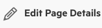__ "Edit Page Details" button, which will present a layer, allowing you to edit that page.  From the layer, you can change the title of the page, and also change the tile for that page.  You have the option to set the size of the tile, the color of the text and the tile image.

### __Edit Page Content__

Navigate to the page that you wish to edit and click the table row that corresponds to the page. Alternatively, select the dropdown menu to see the available options.

When a post is selected, you will navigate to the Page Sections Edit view for the Page that you selected.  Here you will see a list of the sections that make up this page on the left and a preview of the content on the right. 

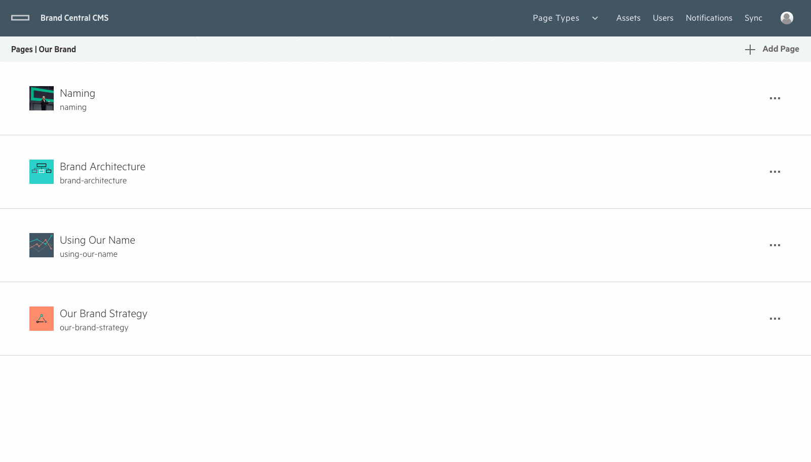

From here, you can either add a new section or edit an existing section.

## Add a Section
Clicking on the the Add Section button __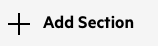__ will bring up a layer that will give you the ability to set the Name of the new section.  You can also set the Flex Direction, which in most cases should remain as `Row` , meaning that the content will layout from left to right in a row.  Column layout will let you layout content from top to bottom, but it's impossible to create a grid using column layout.  For this reason, the majority of the sections on Brand Central will use the row layout and it will be selected as the default option when you create a new section.

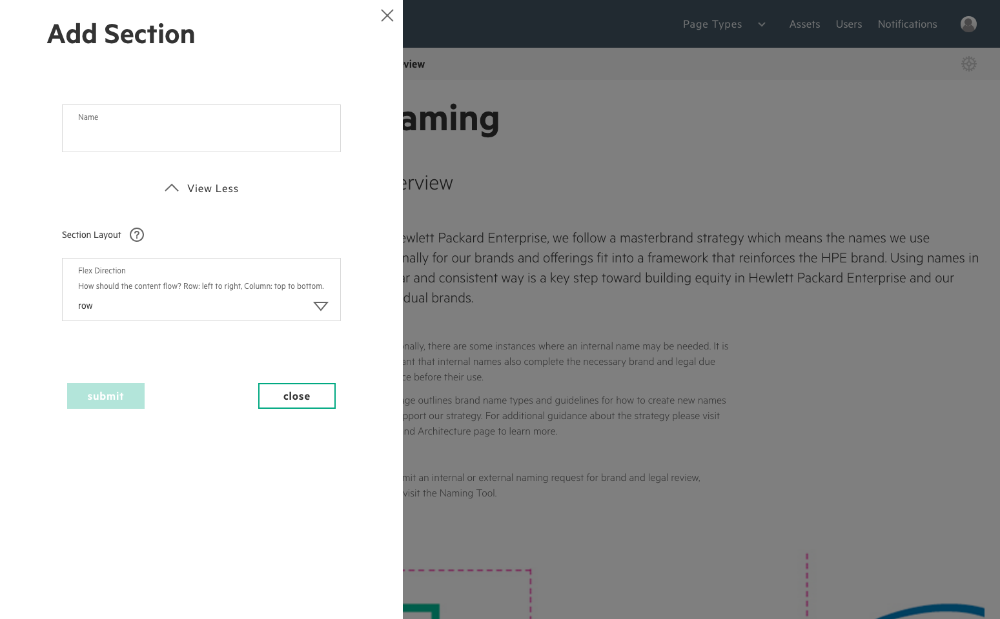

After you add a new section, you can click through to the page content view to add content (more on this later).

Step 1: Fill out the section name and press submit
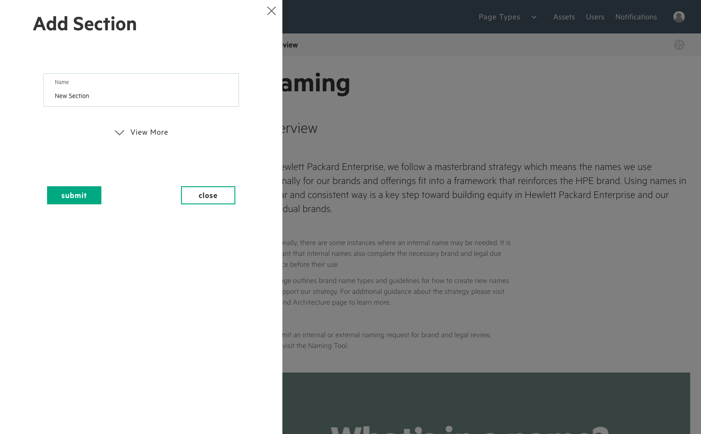

Step 2: Select the new section to drill down into the page content view
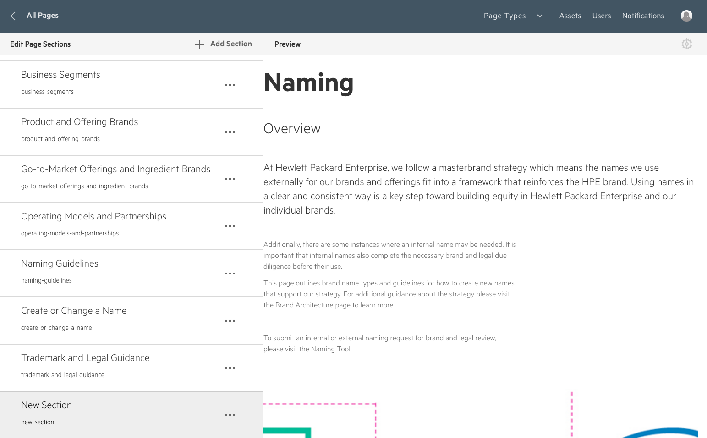

Step 3: View and edit content from the page content view
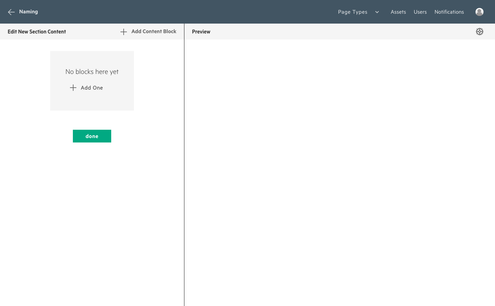

## Edit a Section
You can edit an existing section from the page section view and from the page content view.

### __Page section view__
From the page section view section list, select the ____ "Etc" icon located on the section row that you wish to edit.  From this menu, select the ____ "Edit Section" icon, which will present a layer where you can edit the section details.

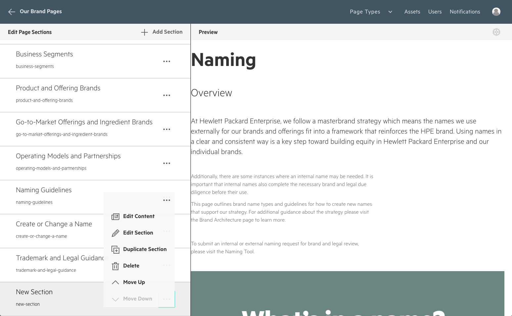

### __Page content view__

Alternatively, from the page content view, you can click the __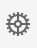__ "Gear" icon to present the same edit section layer.

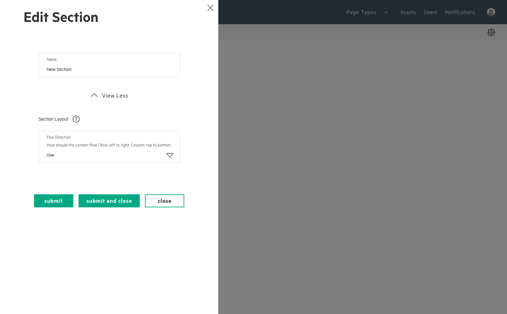
